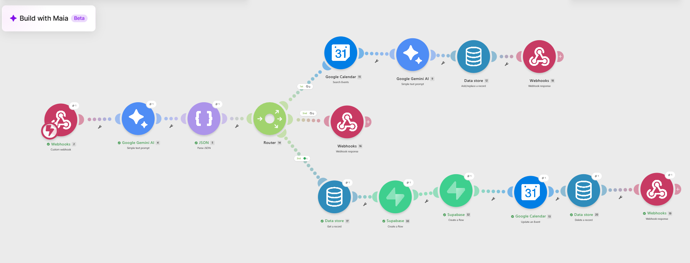
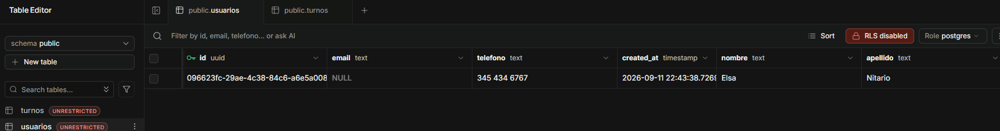
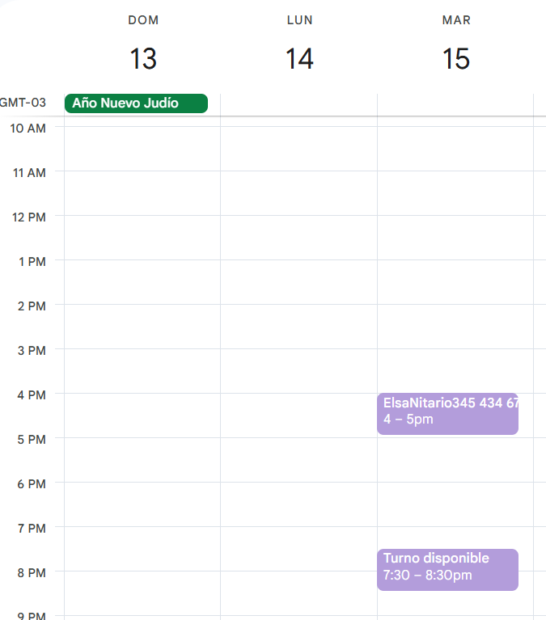

# 🤖 Turnero Digital - Asistente Automatizado con IA ✨

## 📄 Descripción del Proyecto
Este proyecto consiste en un asistente automatizado 💬, diseñado para gestionar la reserva de turnos 📅 mediante un chat 📱. El sistema integra Inteligencia Artificial 🧠 para interpretar los mensajes del usuario 👤, consultar disponibilidad en tiempo real ⏱️, solicitar datos de contacto 📞 y registrar la cita en una base de datos 🗄️ y un calendario 📆, funcionando de manera autónoma 🚀 y sin intervención humana 🚫🧑‍💻.

## ⚠️ Planteamiento del Problema
La gestión manual de citas requiere atención constante 👁️‍🗨️, genera demoras en las respuestas al cliente ⏳ y está sujeta a errores ❌, como anotar mal un dato 📝 o dar el mismo turno a dos personas 👥. Además, los sistemas de reserva tradicionales suelen ser lentos 🐢, obligando al usuario a navegar por varias pantallas 💻, lo cual es mucho menos práctico que simplemente enviar un mensaje de texto 💬📲.

## 💡 Solución Desarrollada
Se implementó un flujo de trabajo automatizado ⚙️ que procesa los mensajes entrantes de los usuarios 📥. El sistema analiza qué necesita el cliente 🕵️‍♂️ y ejecuta diferentes acciones ⚡:
* 🗓️ Consulta fechas y horarios disponibles al instante ⚡.
* 🧵 Mantiene el hilo de la conversación para que el bot recuerde de qué turno están hablando 🧠💬.
* 📇 Extrae el nombre, apellido y teléfono del usuario directamente desde su mensaje 📩.
* 🔒 Guarda los datos del cliente de forma segura 🛡️ y bloquea el horario en el calendario 📌✅.

## 🛠️ Tecnologías Utilizadas
* 🟣 **Make (Integromat):** Plataforma para conectar las distintas aplicaciones 🔌 y configurar la lógica del sistema 🧩.
* ✨ **Google Gemini AI:** Inteligencia Artificial para entender los mensajes 🧠, identificar la intención del usuario 🎯, extraer sus datos personales 📋 y organizar la respuesta 📝.
* 📆 **Google Calendar:** Calendario principal para consultar los turnos disponibles 🕒 y registrar las citas confirmadas ✅.
* 🗄️ **Supabase:** Base de datos en la nube ☁️ para guardar la información de los clientes de manera ordenada 📊.
* 🌐 **Vercel / Frontend:** Plataforma utilizada para alojar la página web 💻 donde el usuario interactúa con el chat 🗨️.

## ⚙️ Arquitectura y Flujo de Trabajo
El núcleo del sistema está configurado en Make.com 🛠️ e incluye un enrutador (Router) 🔀 que divide el proceso en tres caminos posibles 🛣️. El camino a seguir dependerá de lo que la Inteligencia Artificial entienda que quiere hacer el usuario 🤖🧠:

### 1️⃣ Ruta de Búsqueda de Disponibilidad
Cuando el usuario inicia la charla (saluda 👋 o pide un horario 🕒), el sistema busca en Google Calendar 📆 el próximo turno libre 🟢. Guarda un código temporal de esa cita en una memoria 💾 para no perder el contexto de la conversación 🗣️, y le responde al usuario mostrándole la fecha y hora disponibles 📅⏰.

### 2️⃣ Ruta de Respaldo y Manejo de Errores
Esta ruta se activa si el usuario dice algo que no se entiende 🤷, envía mensajes sueltos 🧩 o hace preguntas fuera de contexto ❓. Su función es responder de manera cordial 🤝 y guiar a la persona para que vuelva al proceso de reserva 🔄, evitando que el chat se quede trabado 🛑 o sin respuesta 🔇.

### 3️⃣ Ruta de Confirmación y Registro
Una vez que el usuario recibe la propuesta del turno y escribe sus datos personales ✍️, la Inteligencia Artificial lee el mensaje para separar el nombre, apellido y número de teléfono 📞. El sistema recupera el código temporal de la cita que había guardado en el primer paso 🔄, bloquea ese evento en Google Calendar de forma definitiva 📌 y anota los datos del cliente como un nuevo registro en Supabase 📝🗃️.

## 📸 Evidencia de Funcionamiento

### 🧩 Arquitectura en Make

*Vista de la configuración en Make 🛠️, mostrando la conexión entre las aplicaciones 🔗 y los tres caminos de ejecución 🛤️.*

### 🗂️ Registro en Base de Datos

*Los datos del cliente (nombre, apellido y teléfono) 👤📞 ingresados automáticamente en la base de datos de Supabase tras confirmar el turno ✅📊.*

### 📆 Actualización de Calendario

*El horario, que originalmente estaba libre 🟢, se actualiza automáticamente en Google Calendar 📅 con la confirmación de la reserva 📌🔒.*
